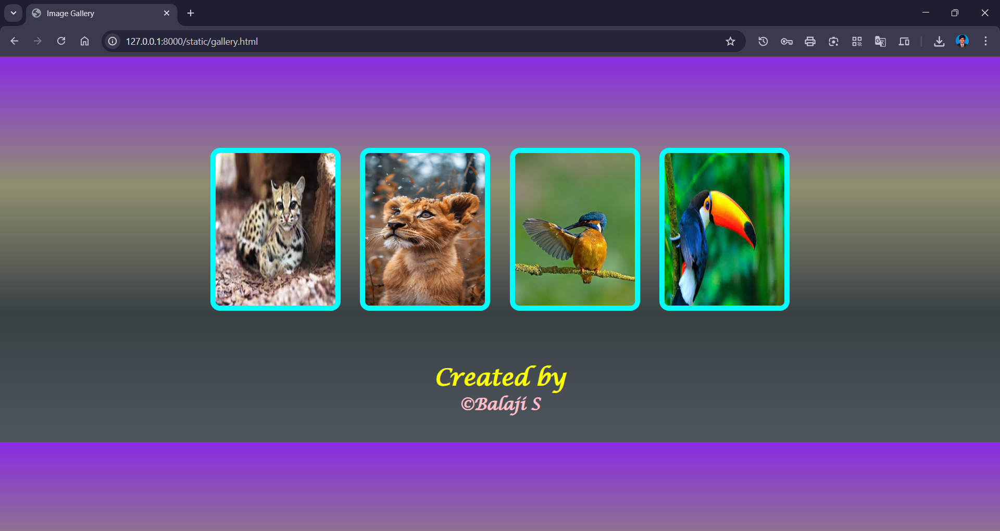

# Ex04 Places Around Me
## Date: 10-10-2025

## AIM
To develop a website to display details about the places around my house.

## DESIGN STEPS

### STEP 1
Create a Django admin interface.

### STEP 2
Download your city map from Google.

### STEP 3
Using ```<map>``` tag name the map.

### STEP 4
Create clickable regions in the image using ```<area>``` tag.

### STEP 5
Write HTML programs for all the regions identified.

### STEP 6
Execute the programs and publish them.

## CODE
```
gallery.html

<!doctype html>
<html lang="en">
<head>
  <meta charset="utf-8">
  <title>Image Gallery</title>
  <link rel="stylesheet" href="style.css">
</head>
<body>
  <div class="gallery">
    
    
    
    
  </div>

  <footer>
    <h1 >Created by</h1>
    <h2 >&copy;Balaji S</h2>
  </footer>

  <script src="script.js"></script>
</body>
</html>

script.js
const images = document.querySelectorAll('.gallery img');

images.forEach(image => {
  image.addEventListener('mouseover', () => {
    image.style.transform = 'scale(2) rotate(5deg)';
    image.style.boxShadow = '0 20px 40px rgba(0,255,255,1)';
  });

  image.addEventListener('mouseout', () => {
    image.style.transform = 'scale(1) rotate(0deg)';
    image.style.boxShadow = '';
  });
});

style.css
* {
  margin: 0;
  padding: 0;
  box-sizing: border-box;
}

body {
  background: linear-gradient(180deg, blueviolet, #8e906f, #384043, #50565f);
  font-family: Cambria, Cochin, Georgia, Times, 'Times New Roman', serif;
  color: white;
  text-align: center;
  padding: 40px 0;
}

.gallery {
  display: flex;
  justify-content: center;
  gap: 30px;
  flex-wrap: wrap;
  margin-top: 100px;
}

.gallery img {
  width: 200px;
  height: 250px;
  border: 8px solid aqua;
  border-radius: 15px;
  transition: transform 1s ease, box-shadow 0.3s ease;
  cursor: pointer;
}

footer {
  margin-top: 80px;
}

h1 {
  font-size: 35px;
  font-family:Lucida Calligraphy;
  color:yellow;
}

h2 {
  font-size:25px;
  font-family:Lucida Calligraphy;
  color:pink;
}

```
## OUTPUT



## RESULT
The program for implementing image maps using HTML is executed successfully.
